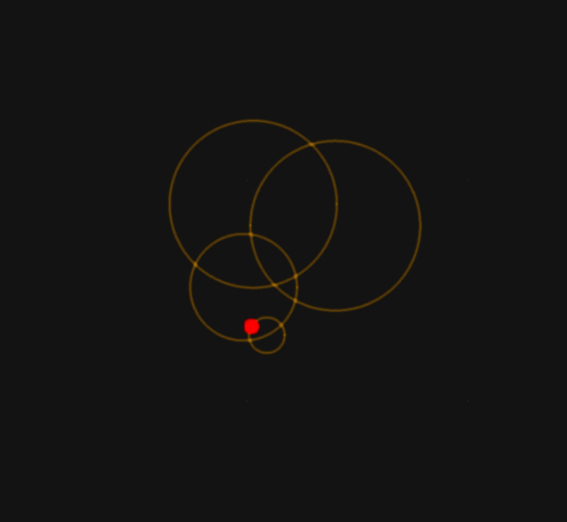
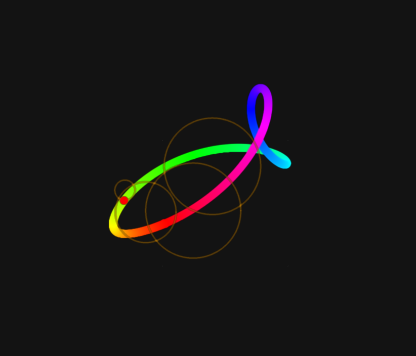
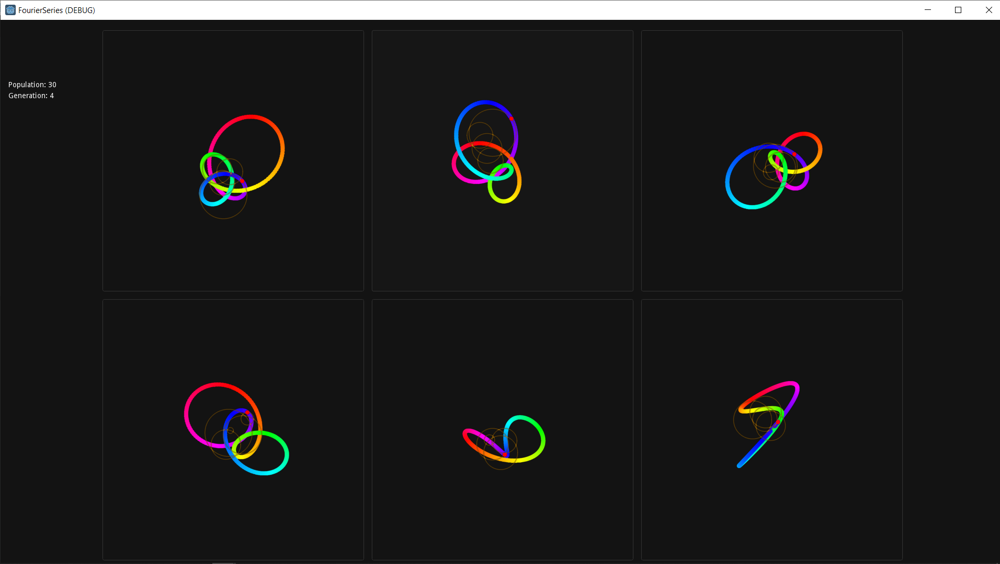

# Fourier Series Evolver

This project is an experiment. The goal is to evolve visual fourier series through a genetic algorithm based on the user's choices.

## Visualize Fourier Series

Each Fourier Series can be represented using the exponential form. Thus each frequency factor is defined by it's coefficient. Those coefficients are defined by an amplitude and a phase.

So it is possible to represent a fourier series in the complex plan by placing chained circles, shifted by the phase, sized by the amplitude and moving at a speed defined by the frequency factor.

  
   

## Evolve Fourier Series
As explained, fourier series are defined by the amplitudes and phases of each frequency. A fourier genome is therefore defined by an ensemble of frequencies and their respective amplitudes and phases.

### Selection

The selection is made by the user, there is a board of 6 series, where one can pick one as favorite. The board then shows new series from the population. Once every genome from the population has been shown, there will be `POPULATION_SIZE/6` selected genomes, they will be the one used by the genetic algorithm to build the next generation.

### Mutation

There are different types of mutations. The first type adds a new frequency to the fourier series. It will add a frequency next to the ones already in the given series and set its amplitude and phase randomly.

The second type is a frequency and phase modifier.

### Breeding

The breeding is done by computing the  mean on the amplitudes and phases of the parents on each frequency.
If a frequency is only in one of the parents, the child will have the frequency and the same values as the parent.

# Coming Next ?
With this first experiment, it was possible to see the effect of selection on the fourier series. By doing some wise selection, it is possible to end up with a population featuring individuals that share a common visual characteristic.
But it still has some limitations, and could be improved to draw more complex shapes, by experimenting and trying different methods for the genetic algorithm.

You are welcome to contribute in any way !